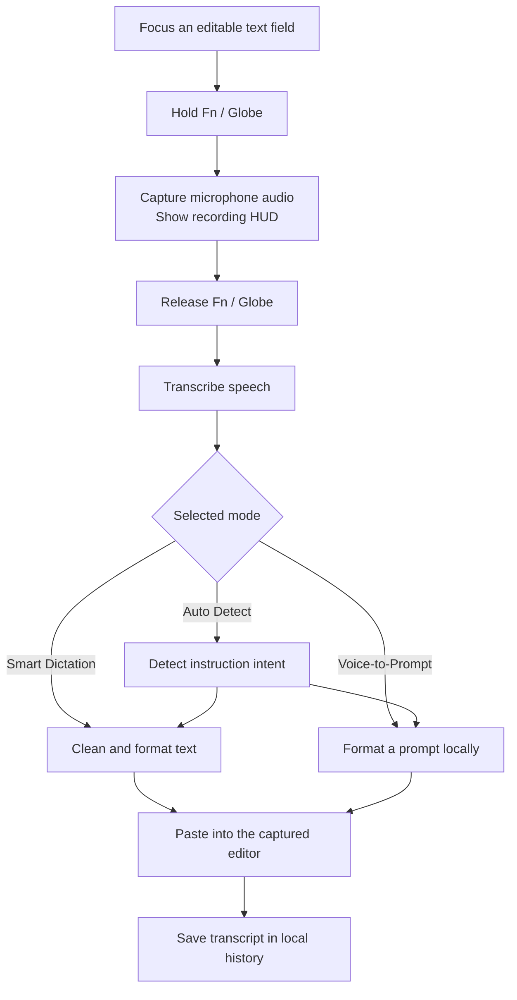

# FlowVoice 🎙️

### Speak naturally. Write at your cursor. Turn ideas into prompts.

FlowVoice is a native macOS app built around a simple interaction: **hold Fn/Globe, speak, and release**. It captures your speech with bundled, offline Whisper recognition, cleans up the transcript, and pastes the result into the text field where you were working.

Inspired by the hold-to-dictate experience of Wispr Flow, this independent project explores a lightweight approach to everyday dictation and voice-written AI prompts. It combines a SwiftUI menu-bar app, a floating recording HUD, Apple speech recognition, local text formatting, and optional speech and AI providers.

[](https://github.com/harshith49/fn-voice/releases/download/v1.0.6/FlowVoice-v1.0.6-apple-silicon.dmg)
[](https://github.com/harshith49/fn-voice/releases/latest)
[](https://github.com/harshith49/fn-voice/releases/latest)
[](LICENSE)

## Download & Install

**[Download FlowVoice v1.0.6 for Apple Silicon](https://github.com/harshith49/fn-voice/releases/download/v1.0.6/FlowVoice-v1.0.6-apple-silicon.dmg)**

No cloning, compiler, or source checkout is needed.

1. Download and open the DMG.
2. Drag **FlowVoice** into **Applications**.
3. Eject the DMG. Open the copy in **Applications**, not the one inside the DMG.
4. Follow the first-launch steps below if macOS displays a security warning.
5. Grant **Accessibility**, **Microphone**, and **Speech Recognition** access when prompted.
6. Click an editable text field, hold **Fn/Globe**, speak after the recording HUD appears, and release.

### First launch: “FlowVoice Not Opened”

This release is ad-hoc signed but **not Apple-notarized**. macOS may show “Apple could not verify FlowVoice is free of malware” even though the DMG downloaded successfully. Only continue if you downloaded it from this repository and trust it; you can compare the DMG's SHA-256 checksum below.

1. In the warning, click **Done** (not **Move to Bin**).
2. Open **System Settings → Privacy & Security** and scroll down to **Security**.
3. Click **Open Anyway** beside FlowVoice, authenticate if asked, then click **Open** in the confirmation dialog.
4. Open FlowVoice from **Applications**. You should not have to repeat this for the same installed copy.

If **Open Anyway** is missing, try opening the Applications copy once more, then return to Privacy & Security soon afterward. If you chose **Move to Bin**, reinstall FlowVoice from the DMG and repeat the steps. Do not disable Gatekeeper globally or run a quarantine-removal command. See [Apple's guidance on opening an unnotarized app](https://support.apple.com/en-us/102445).

| Release | Details |
| --- | --- |
| Version | 1.0.6 |
| Platform | macOS 14 or later |
| Architecture | Apple Silicon / arm64 |
| Installer | `FlowVoice-v1.0.6-apple-silicon.dmg` |
| Size | 61,667,761 bytes |

**SHA-256**

```text
42deb1b3cc5cf5b1fe5a4a38710bb788ee706b1edb704eb57bde29a31915f99b
```

## What You Can Do

### Dictate messages, notes, and instructions

Use **Smart Dictation** to turn speech into cleaned text. The built-in formatter handles common filler words, spacing, capitalization, spoken punctuation, and spoken list markers. For example, saying “new paragraph” inserts a paragraph break, while “bullet point” starts a bullet.

These are rule-based formatting features; they do not promise the full grammatical understanding of an AI model.

### Write prompts for Codex and other AI apps

Use **Voice-to-Prompt** to speak an instruction and insert a formatted prompt into your AI app. Prompt formatting runs locally, needs no API key, and makes no AI-provider call—even if a cloud provider is selected in Settings.

For example, say:

> Build a login page with email and password.

FlowVoice inserts:

```text
Task:
Build a login page with email and password.

Follow the instruction above. Ask for clarification only if essential information is missing.
```

Review and submit the prompt in Codex or your chosen AI app. FlowVoice prepares the instruction; the receiving app executes it.

### Let Auto Detect choose the format

**Auto Detect** uses spoken instruction patterns to choose between ordinary dictation and prompt formatting. You can select either mode explicitly when you want predictable behavior.

## How It Works



## Features Built Into the App

| Feature | What it provides |
| --- | --- |
| Fn/Globe push-to-talk | Hold to record, release to transcribe; short-hold protection and filtering for unrelated or synthetic key events |
| Floating HUD | Recording waveform, processing state, completion feedback, and errors without becoming the key window |
| Menu-bar controls | Access to modes, Dashboard, Settings, History, and Paste Last Transcript |
| Focus-aware insertion | Capture the target application and editor before recording, then paste through the editor's normal input path |
| Permission handling | Live permission refresh, a working Check Again action, and restart/recovery instructions |
| Local history | Review, search, and copy previous dictations and prompts |
| Formatting settings | Control filler removal and capitalization |
| Optional customization | Personal vocabulary and a custom system prompt for provider-based processing |

Insertion depends on the target editor accepting Accessibility updates or paste events. Keep the cursor in the field where you want the result.

## Speech & Processing Options

The default path uses bundled **Whisper base.en (quantized)** and **Built-in Fast Path** formatting. Transcription and prompt formatting run on your Mac, with no API key, subscription, per-minute charge, or runtime model download. The bundled model currently targets English. Choose Apple On-Device in Settings if you prefer its lower-latency path over Whisper accuracy.

Additional options are available in Settings:

- **Local Whisper:** bundled in the DMG, with its English model and Apple Silicon Metal support.
- **Groq / OpenAI speech recognition:** transcribe using your own API key.
- **Local Ollama:** use a separately running local model for provider-based text processing.
- **Groq / OpenAI text processing:** optionally polish dictation using your own API key.

Ollama requires a separate local installation. Optional cloud speech and text processing may incur provider charges and send the relevant audio or text to that provider; FlowVoice does not include an API key or use these services by default. **Voice-to-Prompt formatting itself stays local.**

## Recent Improvements

- Fixed permission-screen actions that could silently fail under SwiftUI's app delegate wiring.
- Added diagnostics from the actual running app instead of relying on a terminal permission check.
- Removed conflicting hotkey monitoring paths and tightened Fn event filtering.
- Prevented new recordings from interrupting an active transcription.
- Made Voice-to-Prompt work without credentials and clarified what it inserts.
- Removed temporary WAV-file processing from Apple recognition by passing audio in memory.
- Added installation-location guidance to avoid permission mismatches between app copies.
- Switched insertion to ordinary paste for native, browser, and Electron editors, including Antigravity-style input fields.
- Bundled an offline Whisper engine and model in the DMG; removed the separate server/CLI requirement.
- Verified the DMG's integrity, mount behavior, bundle signature, and an offline sample transcription.

Physical dictation behavior and latency vary by microphone, recognition engine, language, and target app. Whisper can be slower on the first recording while Metal initializes. No benchmark claim against Wispr Flow is made.

## If Text Does Not Appear

1. Confirm you launched `/Applications/FlowVoice.app`, rather than a copy in the DMG or another folder.
2. Check the permission indicators in FlowVoice's Dashboard.
3. If macOS shows Accessibility enabled but FlowVoice reports denied, remove the old FlowVoice permission entry, add the installed Applications copy, enable it, and restart.
4. Click into the target text field again and hold Fn through the whole phrase.
5. Use **Paste Last Transcript** or copy the text from **History** if the editor rejects automatic insertion.

## About Me

Hi, I'm **Harshith Puvvada**, the creator of FlowVoice. I built this project around an everyday idea: getting thoughts into an app should feel as direct as saying them out loud.

FlowVoice brings together two workflows I wanted in one place—quick dictation and speaking instructions into an AI coding assistant. Building it has meant working through the details that make a desktop tool useful: keyboard events, microphone capture, speech recognition, macOS permissions, editor focus, text insertion, and a downloadable installer.

My goal is to keep improving a tool that feels simple while you use it, even when the engineering behind it is anything but simple.

**[Find me on GitHub → @harshith49](https://github.com/harshith49)**

## Repository & License

This public repository contains the download README and [MIT License](LICENSE). Installers are published as GitHub Release assets. The implementation source and its development history are maintained in a separate private repository.

Copyright © 2026 Harshith Puvvada. Distributed under the **MIT License**.

FlowVoice is an independent project and is not affiliated with Wispr Flow.
