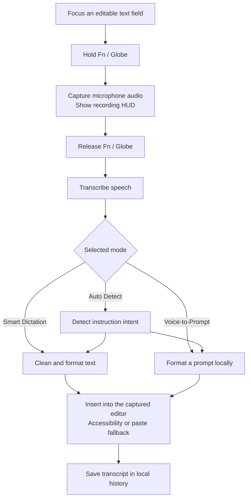

# FlowVoice 🎙️

### Speak naturally. Write at your cursor. Turn ideas into prompts.

FlowVoice is a native macOS app built around a simple interaction: **hold Fn/Globe, speak, and release**. It captures your speech, cleans up the transcript, and inserts the result into the text field where you were working.

Inspired by the hold-to-dictate experience of Wispr Flow, this independent project explores a lightweight approach to everyday dictation and voice-written AI prompts. It combines a SwiftUI menu-bar app, a floating recording HUD, Apple speech recognition, local text formatting, and optional speech and AI providers.

[](https://github.com/harshith49/fn-voice/releases/download/v1.0.5/FlowVoice-v1.0.5-apple-silicon.dmg)
[](https://github.com/harshith49/fn-voice/releases/latest)
[](https://github.com/harshith49/fn-voice/releases/latest)
[](LICENSE)

## Download & Install

**[Download FlowVoice v1.0.5 for Apple Silicon](https://github.com/harshith49/fn-voice/releases/download/v1.0.5/FlowVoice-v1.0.5-apple-silicon.dmg)**

No cloning, compiler, or source checkout is needed.

1. Download and open the DMG.
2. Drag **FlowVoice** into **Applications**.
3. Eject the DMG and open the installed app from Applications.
4. Grant **Accessibility**, **Microphone**, and **Speech Recognition** access.
5. Click an editable text field, hold **Fn/Globe**, speak after the recording HUD appears, and release.

The current release is ad-hoc signed rather than Apple-notarized. On first launch, use **Control-click → Open**; if macOS blocks it, review the FlowVoice entry in **System Settings → Privacy & Security → Open Anyway**.

| Release | Details |
| --- | --- |
| Version | 1.0.5 |
| Platform | macOS 14 or later |
| Architecture | Apple Silicon / arm64 |
| Installer | `FlowVoice-v1.0.5-apple-silicon.dmg` |
| Size | 1,971,423 bytes |

**SHA-256**

```text
8a4b748768246b1ede2c5e55856904696aebc3758564750a485ee65f8e4d2db6
```

## What You Can Do

### Dictate messages, notes, and instructions

Use **Smart Dictation** to turn speech into cleaned text. The built-in formatter handles common filler words, spacing, capitalization, spoken punctuation, and spoken list markers. For example, saying “new paragraph” inserts a paragraph break, while “bullet point” starts a bullet.

These are rule-based formatting features; they do not promise the full grammatical understanding of an AI model.

### Write prompts for Codex and other AI apps

Use **Voice-to-Prompt** to speak an instruction and insert a formatted prompt into your AI app. Prompt formatting runs locally, needs no API key, and makes no AI-provider call—even if a cloud provider is selected in Settings.

For example, say:

> Build a login page with email and password.

FlowVoice inserts:

```text
Task:
Build a login page with email and password.

Follow the instruction above. Ask for clarification only if essential information is missing.
```

Review and submit the prompt in Codex or your chosen AI app. FlowVoice prepares the instruction; the receiving app executes it.

### Let Auto Detect choose the format

**Auto Detect** uses spoken instruction patterns to choose between ordinary dictation and prompt formatting. You can select either mode explicitly when you want predictable behavior.

## How It Works



## Features Built Into the App

| Feature | What it provides |
| --- | --- |
| Fn/Globe push-to-talk | Hold to record, release to transcribe; short-hold protection and filtering for unrelated or synthetic key events |
| Floating HUD | Recording waveform, processing state, completion feedback, and errors without becoming the key window |
| Menu-bar controls | Access to modes, Dashboard, Settings, History, and Paste Last Transcript |
| Focus-aware insertion | Capture the target application and editor before recording, with a Cmd+V fallback |
| Permission handling | Live permission refresh, a working Check Again action, and restart/recovery instructions |
| Local history | Review, search, and copy previous dictations and prompts |
| Formatting settings | Control filler removal and capitalization |
| Optional customization | Personal vocabulary and a custom system prompt for provider-based processing |

Insertion depends on the target editor accepting Accessibility updates or paste events. Keep the cursor in the field where you want the result.

## Speech & Processing Options

The default path uses **Apple speech recognition** and **Built-in Fast Path** formatting. Apple recognition prefers on-device processing where supported; availability depends on the device, language, and installed speech resources.

Additional options are available in Settings:

- **Local Whisper:** connect to a separately configured local Whisper server or CLI.
- **Groq / OpenAI speech recognition:** transcribe using your own API key.
- **Local Ollama:** use a separately running local model for provider-based text processing.
- **Groq / OpenAI text processing:** optionally polish dictation using your own API key.

Local services and their models are not bundled in the DMG. Cloud speech and text processing may incur provider charges and send the relevant audio or text to that provider. **Voice-to-Prompt formatting itself stays local.**

## Recent Improvements

- Fixed permission-screen actions that could silently fail under SwiftUI's app delegate wiring.
- Added diagnostics from the actual running app instead of relying on a terminal permission check.
- Removed conflicting hotkey monitoring paths and tightened Fn event filtering.
- Prevented new recordings from interrupting an active transcription.
- Made Voice-to-Prompt work without credentials and clarified what it inserts.
- Removed temporary WAV-file processing from Apple recognition by passing audio in memory.
- Added installation-location guidance to avoid permission mismatches between app copies.
- Fixed insertion into Antigravity's web editor by using its normal paste path and preserving its focused input.
- Verified the DMG's integrity, mount behavior, and bundle signature, plus packaged prompt-formatting checks.

Physical dictation behavior and latency vary by microphone, recognition engine, language, and target app. No benchmark claim against Wispr Flow is made.

## If Text Does Not Appear

1. Confirm you launched `/Applications/FlowVoice.app`, rather than a copy in the DMG or another folder.
2. Check the permission indicators in FlowVoice's Dashboard.
3. If macOS shows Accessibility enabled but FlowVoice reports denied, remove the old FlowVoice permission entry, add the installed Applications copy, enable it, and restart.
4. Click into the target text field again and hold Fn through the whole phrase.
5. Use **Paste Last Transcript** or copy the text from **History** if the editor rejects automatic insertion.

## About Me

Hi, I'm **Harshith Puvvada**, the creator of FlowVoice. I built this project around an everyday idea: getting thoughts into an app should feel as direct as saying them out loud.

FlowVoice brings together two workflows I wanted in one place—quick dictation and speaking instructions into an AI coding assistant. Building it has meant working through the details that make a desktop tool useful: keyboard events, microphone capture, speech recognition, macOS permissions, editor focus, text insertion, and a downloadable installer.

My goal is to keep improving a tool that feels simple while you use it, even when the engineering behind it is anything but simple.

**[Find me on GitHub → @harshith49](https://github.com/harshith49)**

## Repository & License

This public repository contains the download README and [MIT License](LICENSE). Installers are published as GitHub Release assets. The implementation source and its development history are maintained in a separate private repository.

Copyright © 2026 Harshith Puvvada. Distributed under the **MIT License**.

FlowVoice is an independent project and is not affiliated with Wispr Flow.
